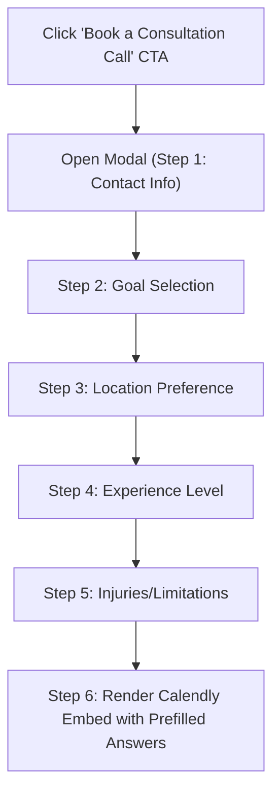

# Calendly Integration Plan (Updated: Modal & Questionnaire Flow)

This document details the updated plan to integrate Calendly booking into a custom modal experience rather than an inline page. The booking flow begins with a 5-question intake form to gather visitor intent and profile information. Once submitted, the modal loads the Calendly scheduler inline, prefilled with their answers.

---

## A) User Flow & Recommended Modal Approach

Instead of redirecting users to a standalone `/book-call` page, we will implement a custom, animated modal using the project's Radix-based UI Dialog components.

### Step-by-Step User Flow



### Proposed Questions

We suggest the following 5 intake questions, which align with personal training onboarding:

1. **Contact Details** (Built-in Name and Email - prefilled from `useAuth` if logged in)
   * *Type*: Inputs
   * *Required*: Yes
2. **Primary Fitness Goal**
   * *Type*: Multiple Choice (Cards Grid)
   * *Options*:
     * 💪 Strength & Muscle Gain
     * 🏃 Weight Loss & Conditioning
     * 🧘 Mobility, Flexibility & Rehab
     * 🎯 Athletic Performance / Sport Specific
3. **Preferred Training Location**
   * *Type*: Multiple Choice (Pills)
   * *Options*:
     * 🏢 Indoor Studio (Barcelona Centre)
     * 🏖️ Outdoor (Park/Beach in Barcelona)
     * 🏠 Online / Home Training
4. **Training Experience Level**
   * *Type*: Multiple Choice (Select/Pills)
   * *Options*:
     * 🟢 Beginner (Under 6 months)
     * 🟡 Intermediate (1-2 years)
     * 🔴 Advanced (3+ years)
5. **Injuries, Health Conditions, or Limitations**
   * *Type*: Text Area
   * *Required*: No (Optional description for custom coach prep)

---

## B) Step-by-Step Task List

### Phase 1: Custom Modal Component
- [ ] Create `CalendlyModal` component in `src/components/site/CalendlyModal.tsx`.
- [ ] Implement multi-step questionnaire layout states (Steps 1 to 6) with progress bar.
- [ ] Add form validation (Zod + React Hook Form or lightweight React state check) to ensure Name and Email are valid before proceeding.
- [ ] Integrate local storage caching so that if the user closes the modal halfway, their answers are preserved when they re-open it.

### Phase 2: Calendly Integration & Mapping
- [ ] Map the collected answers to Calendly's JS prefill parameters:
  * `name` -> Invitee Name
  * `email` -> Invitee Email
  * `customAnswers` -> `a1` (Goal), `a2` (Location), `a3` (Experience), `a4` (Injuries)
- [ ] Embed the `CalendlyInline` component directly inside Step 6 of the modal, ensuring it automatically receives the answers on mount.

### Phase 3: Route & Layout Modification
- [ ] Deprecate the dedicated route `/book-call` (either remove it or make it redirect to the home page with a query parameter like `?book=true` to automatically trigger the modal on load).
- [ ] Modify `src/components/site/BookingCTA.tsx` (Homepage bottom CTA) to mount and trigger the `CalendlyModal` component.
- [ ] Modify `src/routes/client/dashboard.tsx` (Client Dashboard) to support triggering the same questionnaire modal.

### Phase 4: Quality Assurance & Testing
- [ ] Test the form flow (ensuring no layout shift when changing steps).
- [ ] Verify that final step correctly mounts the iframe and automatically inserts the name/email/answers in the scheduler.
- [ ] Validate on desktop and mobile browsers.

---

## C) Proposed File and Component Changes

### 1. `src/components/site/CalendlyModal.tsx` [NEW]
A custom modal built using shadcn Dialog components (`src/components/ui/dialog.tsx`).

Key functionality:
- Displays a visual progress bar (`src/components/ui/progress.tsx`).
- Interactive selection cards with hover/focus states matching our premium dark theme.
- **Calendly Prefill Transport**:
  ```typescript
  const handleFormSubmit = () => {
    setPrefillData({
      name: formData.name,
      email: formData.email,
      customAnswers: {
        a1: formData.goal,
        a2: formData.location,
        a3: formData.experience,
        a4: formData.injuries || "None declared",
      }
    });
    setStep(6); // Show Calendly
  };
  ```

### 2. `src/routes/book-call.tsx` [MODIFY/DELETE]
Redirect the route to `/` with query parameters to open the modal, keeping URLs backwards-compatible:
```typescript
export const Route = createFileRoute("/book-call")({
  beforeLoad: ({ search }) => {
    throw redirect({
      to: "/",
      search: { bookCall: "true" },
    });
  },
});
```

### 3. `src/components/site/BookingCTA.tsx` [MODIFY]
Mount `CalendlyModal` and link the "Book a Consultation Call" button click handler to open it.

### 4. `src/routes/client/dashboard.tsx` [MODIFY]
Add the `CalendlyModal` trigger to the portal's "Book a Call" button.

---

## D) QA & Configuration Details

### Calendly Question Configuration Setup (Crucial Admin Steps)
> [!IMPORTANT]
> **Exact Question Order in Calendly Dashboard**:
> Inside Calendly, the Admin must order the custom invitee questions exactly as follows for the automated mapping to succeed:
> 1. *Question 1*: Primary Fitness Goal
> 2. *Question 2*: Preferred Training Location
> 3. *Question 3*: Training Experience Level
> 4. *Question 4*: Injuries, Health Conditions, or Limitations
>
> If the coach changes this question ordering inside Calendly, the mapped answers will appear in the wrong textboxes.

### Cookie Consent & Privacy
Since we are using the JS embed widget inside our modal, we pass `hideGdprBanner: true` to prevent double-cookie banners, but ensure we note this data transaction in our privacy notice. No data is sent to Calendly until the user proceeds to the final step and mounts the scheduler.
